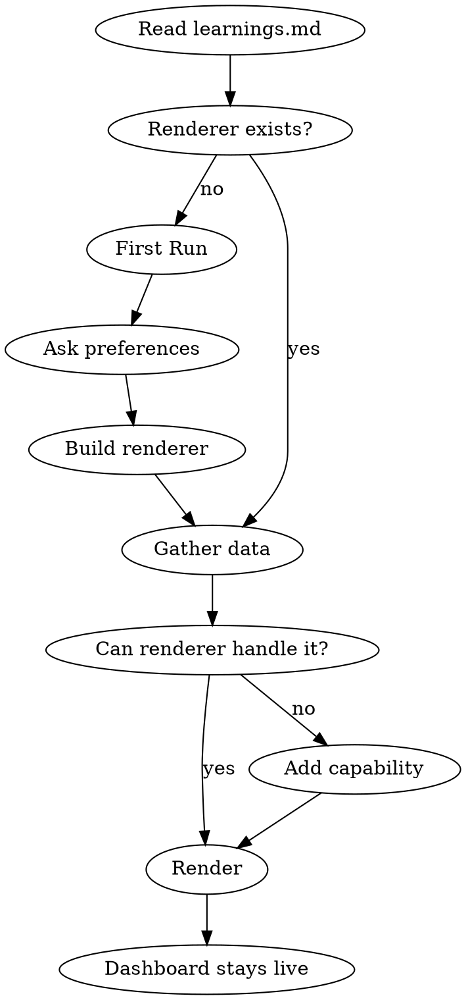

# Dashboard

Self-improving terminal dashboard with a learning loop. You own the rendering — framework, layout, data sources, and refresh strategy are your decisions.

## Modes

Parse the invocation to determine mode:

- `/dashboard` — **Render** (default)
- `/dashboard feedback <text>` — **Feedback**
- `/dashboard rebuild` — **Rebuild**

## Workspace

Path: `${CLAUDE_SKILL_DIR}/workspace/`

```
workspace/
  learnings.md    # your accumulated knowledge — READ THIS FIRST on every invocation
  renderer/       # your rendering code (structure is your choice)
```

**Always read `learnings.md` before doing anything.** It contains user preferences, past decisions, bugs you've fixed, and experiments that failed.

## Render Mode



### First run (empty workspace)

Ask the user:
1. Framework preference (e.g., rich, textual, or suggest alternatives)
2. What data matters most to them right now
3. Any visual preferences (density, font, colors)

Then build the initial renderer, gather data, render, and log all preferences + decisions to `learnings.md`.

### Subsequent runs

1. Gather data using whatever tools are available — you decide what's relevant
2. If the renderer can handle the data, run it
3. If new data needs a capability the renderer doesn't have, add it incrementally, then render
4. If a data source is unavailable, render what you can and indicate what's missing

### Data sources

Use any available tools: MCP (Cortex, GitHub, Linear, Slack, Sentry, Datadog, PostHog), Bash (`gh`, `git`), skills, etc. You decide what to gather based on the user's preferences and what tools exist.

The dashboard should define data sources with refresh strategies (poll intervals, subscriptions) so it stays live after the initial render.

### Time budget

Optimize for speed. The user is waiting. If you can render now, do it — improve later.

## Feedback Mode

`/dashboard feedback <text>`

1. Log to `learnings.md` — infer type and severity from the text (see LEARNING_FORMAT.md)
2. Act based on priority:

| Priority | Type | Action |
|----------|------|--------|
| 1 | Bug / critical | Fix renderer immediately |
| 2 | Feature / critical | Add on next render |
| 3 | Bug / normal | Fix on next render |
| 4 | Improvement / normal | Patch if quick, else log |
| 5 | Feature / normal | Log, next render picks it up |
| 6 | Low severity anything | Log only |

## Rebuild Mode

`/dashboard rebuild`

A dedicated interactive session for improving the renderer. Not a rewrite — builds on what exists unless the user says otherwise.

1. Read all accumulated learnings
2. Discuss what to change with the user
3. Implement changes (layout, framework, components, performance — whatever's needed)
4. No time pressure — this is an intentional improvement session

## Learning Loop

Read LEARNING_FORMAT.md for the entry format.

**When to log:**
- Every preference expressed by the user
- Every rendering decision you make and why
- Every bug found and how it was fixed
- Data source reliability observations
- Experiments that didn't work (so you don't repeat them)

**When to prompt for feedback:**
- After building a new capability ("I just added X — does this look right?")
- After a rebuild session
- If no feedback received in ~10 renders
- Never during background/cron invocations

**What NOT to log:** raw data (PRs, streams), session-specific context.

## Minimum Capabilities

The dashboard must be a live-updating persistent display with visual hierarchy (colors, tables, progress indicators). A one-shot markdown dump is not sufficient — the output should remain visible and refresh as data changes.

The specific framework is chosen during the first render session, not prescribed here.
